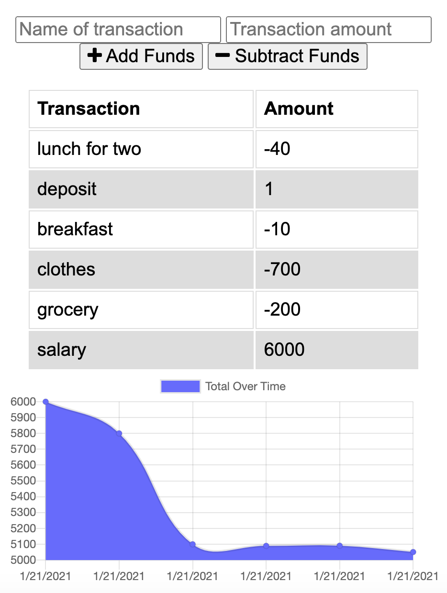

# Offline Budget Tracker 
  Budget tracker with offline functionality
  # Table of Contents
  1. [Detailed Description](#deatiled-description)
  2. [Installation](#installation)
  3. [Usage](#usage)
  4. [License](#license)
  5. [Contribution Guidelines](#contribution-guidelines)
  6. [Questions](#questions)
## Detailed Description
App deployed at [Heroku](https://mysterious-cove-07109.herokuapp.com/).

Apps look like 

Main idea of this project was adding offline functionality to budget tracker. It was realised with help of indexedDB, Service-workers and Cache. 

File `db.js` contains code to work with indexedDB, that allows to store transaction when server is offline.

File `service-worker.js` contains code of service worker that works with cache and allows to "refresh" page even if there are no network connection.

## Installation
To install locally  please use: 

`git clone`  

`npm i`
## Usage
To use locally do next: 
`npm start`
## License
[License: MIT](https://opensource.org/licenses/MIT)
## Contribution Guidelines 
No contribution is needed at this moment. If you want to contribute you can contact me.
## Questions
For questionts please contact [me](https://github.com/Myau5x) at ola.illari@gmail.com
 

